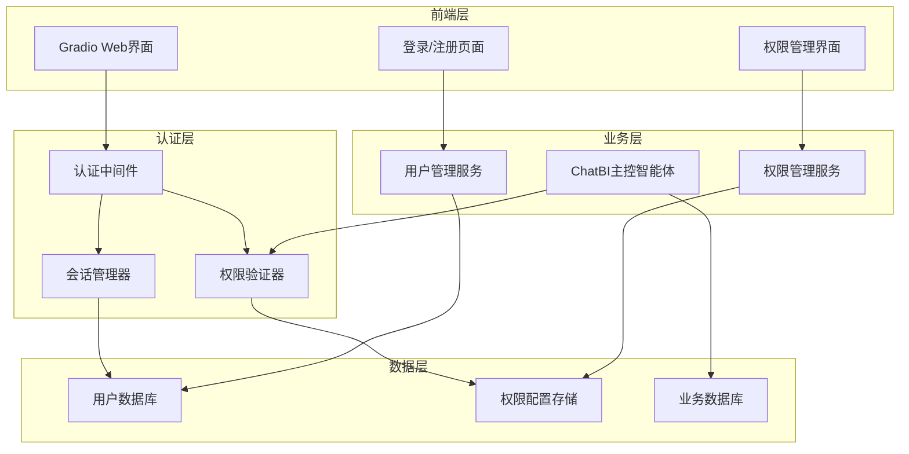

# 设计文档

## 概述

用户认证和权限管理模块将为ChatBI系统添加完整的用户管理功能，包括基于工号的注册控制、用户认证、会话管理和数据库权限控制。该模块将与现有的ChatBI架构无缝集成，确保数据安全和访问控制。

## 架构

### 整体架构图



### 模块关系

1. **认证模块** - 处理用户登录、注册和会话管理
2. **权限模块** - 管理用户对数据库schema的访问权限
3. **中间件模块** - 拦截请求进行身份验证和权限检查
4. **集成模块** - 与现有ChatBI组件的集成适配器

## 组件和接口

### 1. 用户管理组件

#### UserManager类
```python
class UserManager:
    def register_user(self, employee_id: str, password: str, email: str) -> UserRegistrationResult
    def authenticate_user(self, employee_id: str, password: str) -> AuthenticationResult
    def get_user_info(self, user_id: str) -> UserInfo
    def update_user_info(self, user_id: str, updates: Dict) -> bool
    def delete_user(self, user_id: str) -> bool
    def is_employee_id_allowed(self, employee_id: str) -> bool
```

#### AllowedEmployeeManager类
```python
class AllowedEmployeeManager:
    def add_allowed_employee(self, employee_id: str, added_by: str) -> bool
    def remove_allowed_employee(self, employee_id: str, removed_by: str) -> bool
    def get_allowed_employees(self) -> List[str]
    def is_employee_allowed(self, employee_id: str) -> bool
```

### 2. 权限管理组件

#### PermissionManager类
```python
class PermissionManager:
    def assign_schema_permission(self, user_id: str, schema_name: str, permission_level: str) -> bool
    def revoke_schema_permission(self, user_id: str, schema_name: str) -> bool
    def get_user_schemas(self, user_id: str) -> List[str]
    def check_schema_access(self, user_id: str, schema_name: str) -> bool
    def get_user_permissions(self, user_id: str) -> Dict[str, str]
```

#### DatabasePermissionFilter类
```python
class DatabasePermissionFilter:
    def filter_schemas(self, user_id: str, available_schemas: List[str]) -> List[str]
    def validate_sql_permissions(self, user_id: str, sql_query: str) -> ValidationResult
    def create_user_specific_connection(self, user_id: str) -> DatabaseConnector
```

### 3. 会话管理组件

#### SessionManager类
```python
class SessionManager:
    def create_session(self, user_id: str, ip_address: str) -> SessionToken
    def validate_session(self, token: str) -> SessionValidationResult
    def refresh_session(self, token: str) -> SessionToken
    def invalidate_session(self, token: str) -> bool
    def cleanup_expired_sessions(self) -> int
```

#### AuthenticationMiddleware类
```python
class AuthenticationMiddleware:
    def authenticate_request(self, request: Request) -> AuthenticationResult
    def require_login(self, func: Callable) -> Callable
    def require_permission(self, schema: str) -> Callable
```

### 4. 集成适配器

#### ChatBIAuthIntegration类
```python
class ChatBIAuthIntegration:
    def wrap_orchestrator(self, orchestrator: ChatBIOrchestrator) -> AuthenticatedOrchestrator
    def create_user_database_connector(self, user_id: str) -> DatabaseConnector
    def filter_schema_info(self, user_id: str, schema_info: str) -> str
```

## 数据模型

### 用户表 (users)
```sql
CREATE TABLE users (
    id VARCHAR(36) PRIMARY KEY,
    employee_id VARCHAR(50) UNIQUE NOT NULL,
    password_hash VARCHAR(255) NOT NULL,
    email VARCHAR(255),
    full_name VARCHAR(100),
    is_active BOOLEAN DEFAULT TRUE,
    is_admin BOOLEAN DEFAULT FALSE,
    created_at TIMESTAMP DEFAULT CURRENT_TIMESTAMP,
    updated_at TIMESTAMP DEFAULT CURRENT_TIMESTAMP ON UPDATE CURRENT_TIMESTAMP,
    last_login TIMESTAMP,
    login_count INTEGER DEFAULT 0
);
```

### 允许注册工号表 (allowed_employees)
```sql
CREATE TABLE allowed_employees (
    employee_id VARCHAR(50) PRIMARY KEY,
    added_by VARCHAR(36) NOT NULL,
    added_at TIMESTAMP DEFAULT CURRENT_TIMESTAMP,
    description TEXT,
    FOREIGN KEY (added_by) REFERENCES users(id)
);
```

### 用户权限表 (user_permissions)
```sql
CREATE TABLE user_permissions (
    id VARCHAR(36) PRIMARY KEY,
    user_id VARCHAR(36) NOT NULL,
    schema_name VARCHAR(100) NOT NULL,
    permission_level ENUM('read', 'write', 'admin') DEFAULT 'read',
    granted_by VARCHAR(36) NOT NULL,
    granted_at TIMESTAMP DEFAULT CURRENT_TIMESTAMP,
    expires_at TIMESTAMP NULL,
    is_active BOOLEAN DEFAULT TRUE,
    UNIQUE KEY unique_user_schema (user_id, schema_name),
    FOREIGN KEY (user_id) REFERENCES users(id),
    FOREIGN KEY (granted_by) REFERENCES users(id)
);
```

### 会话表 (user_sessions)
```sql
CREATE TABLE user_sessions (
    id VARCHAR(36) PRIMARY KEY,
    user_id VARCHAR(36) NOT NULL,
    session_token VARCHAR(255) UNIQUE NOT NULL,
    ip_address VARCHAR(45),
    user_agent TEXT,
    created_at TIMESTAMP DEFAULT CURRENT_TIMESTAMP,
    expires_at TIMESTAMP NOT NULL,
    last_activity TIMESTAMP DEFAULT CURRENT_TIMESTAMP,
    is_active BOOLEAN DEFAULT TRUE,
    FOREIGN KEY (user_id) REFERENCES users(id)
);
```

### 审计日志表 (audit_logs)
```sql
CREATE TABLE audit_logs (
    id VARCHAR(36) PRIMARY KEY,
    user_id VARCHAR(36),
    action VARCHAR(100) NOT NULL,
    resource_type VARCHAR(50),
    resource_id VARCHAR(100),
    details JSON,
    ip_address VARCHAR(45),
    user_agent TEXT,
    created_at TIMESTAMP DEFAULT CURRENT_TIMESTAMP,
    FOREIGN KEY (user_id) REFERENCES users(id)
);
```

## 错误处理

### 认证错误
- `AuthenticationError` - 身份验证失败
- `InvalidCredentialsError` - 凭据无效
- `AccountDisabledError` - 账户被禁用
- `SessionExpiredError` - 会话过期

### 权限错误
- `PermissionDeniedError` - 权限不足
- `SchemaAccessDeniedError` - Schema访问被拒绝
- `UnauthorizedOperationError` - 未授权操作

### 注册错误
- `EmployeeNotAllowedError` - 工号不在允许列表中
- `UserAlreadyExistsError` - 用户已存在
- `InvalidEmployeeIdError` - 无效工号格式

### 错误处理策略
1. **统一错误响应格式**
2. **详细的错误日志记录**
3. **用户友好的错误消息**
4. **安全的错误信息披露**

## 测试策略

### 单元测试
- 用户管理功能测试
- 权限验证逻辑测试
- 会话管理测试
- 密码加密和验证测试

### 集成测试
- 认证中间件集成测试
- 数据库权限过滤测试
- ChatBI组件集成测试
- 前端界面集成测试

### 安全测试
- SQL注入防护测试
- 会话劫持防护测试
- 权限绕过测试
- 密码安全性测试

### 性能测试
- 大量用户并发登录测试
- 权限检查性能测试
- 会话管理性能测试
- 数据库查询性能测试

## 安全考虑

### 密码安全
- 使用bcrypt进行密码哈希
- 强制密码复杂度要求
- 密码历史记录防重复
- 定期密码过期提醒

### 会话安全
- 安全的会话令牌生成
- 会话超时机制
- 会话固定攻击防护
- 多设备会话管理

### 数据库安全
- SQL注入防护
- 参数化查询
- 最小权限原则
- 敏感数据加密

### 审计和监控
- 完整的操作审计日志
- 异常登录行为检测
- 权限变更监控
- 安全事件告警

## 配置管理

### 认证配置
```python
@dataclass
class AuthConfig:
    session_timeout: int = 3600  # 会话超时时间（秒）
    max_login_attempts: int = 5  # 最大登录尝试次数
    lockout_duration: int = 900  # 账户锁定时间（秒）
    password_min_length: int = 8  # 密码最小长度
    require_password_complexity: bool = True  # 是否要求密码复杂度
    jwt_secret_key: str = ""  # JWT密钥
    jwt_algorithm: str = "HS256"  # JWT算法
```

### 权限配置
```python
@dataclass
class PermissionConfig:
    default_schema_access: List[str] = None  # 默认schema访问权限
    admin_schemas: List[str] = None  # 管理员可访问的所有schema
    schema_isolation_enabled: bool = True  # 是否启用schema隔离
    permission_cache_ttl: int = 300  # 权限缓存TTL（秒）
```

## 部署考虑

### 数据库迁移
- 创建认证相关数据表
- 数据迁移脚本
- 版本控制和回滚机制

### 配置更新
- 环境变量配置
- 配置文件更新
- 密钥管理

### 向后兼容
- 现有功能保持不变
- 渐进式启用认证
- 管理员账户初始化

### 监控和维护
- 用户活动监控
- 性能指标收集
- 定期安全审计
- 日志轮转和清理