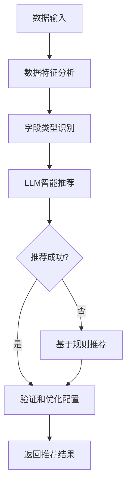

# ChatBI Agent交互逻辑升级总结

## 🎯 升级目标

将原有的"可视化agent依赖分析agent建议"的逻辑调整为：
1. **图表智能体独立工作**：能够根据SQL查询后的数据进行智能可视化，不依赖分析agent
2. **分析agent作为补充**：只有在用户选择需要分析时，才考虑参考分析agent的可视化建议
3. **提高灵活性**：让可视化推荐更加智能和独立

## 🔧 主要改动

### 1. 新增图表智能体 (ChartAgent)

**文件**: `chatbi/agents/chart_agent.py`

**核心功能**:
- 独立分析数据特征（数值型、分类型、时间型字段）
- 基于数据特征智能推荐图表类型
- 使用LLM进行智能分析，同时提供基于规则的回退方案
- 支持多种图表类型：柱状图、折线图、饼图、散点图、直方图

**关键方法**:
```python
def analyze_and_recommend_chart(self, data, question="", columns=None):
    """分析数据并推荐图表类型"""
    
def _analyze_data_characteristics(self, df):
    """分析数据特征"""
    
def _build_analysis_prompt(self, data_analysis, question=""):
    """构建数据分析提示"""
    
def _rule_based_recommendation(self, data_analysis):
    """基于规则的图表推荐（回退方案）"""
```

### 2. 更新Orchestrator交互逻辑

**文件**: `chatbi/orchestrator.py`

**原有流程**:
```
SQL执行 → 数据分析 → 可视化建议 → 图表创建
```

**新流程**:
```
SQL执行 → 智能可视化分析 → 图表创建 → 数据分析（可选）→ 补充可视化（如需要）
```

**新增方法**:
```python
def _get_smart_visualization_recommendation(self, sql_result, question):
    """使用图表智能体获取智能可视化建议"""
    
def _get_analysis_based_visualization_suggestion(self, sql_result, question):
    """基于数据分析agent获取可视化建议（作为补充）"""
```

### 3. 更新Agent模块导出

**文件**: `chatbi/agents/__init__.py`

添加了ChartAgent的导出：
```python
from .chart_agent import ChartAgent, get_chart_agent
```

## 📊 智能推荐规则

### 图表类型选择逻辑

1. **柱状图 (bar)**
   - 适用：1个分类字段 + 1个数值字段
   - 条件：分类数量 ≤ 20个
   - 场景：分类数据对比、排名展示

2. **折线图 (line)**
   - 适用：1个时间/序列字段 + 1个数值字段
   - 场景：时间趋势分析、连续数据变化

3. **饼图 (pie)**
   - 适用：1个分类字段 + 1个数值字段（占比）
   - 条件：分类数量 ≤ 8个，数据行数 ≤ 10行
   - 场景：部分与整体关系、占比分析

4. **散点图 (scatter)**
   - 适用：2个数值字段
   - 场景：两个数值变量的相关性分析

5. **直方图 (histogram)**
   - 适用：1个数值字段
   - 条件：数据量 > 20行
   - 场景：数值分布分析、频率统计

### 智能分析流程



## 🔄 新的工作流程

### 1. 独立可视化模式（默认）

```python
# 步骤1: SQL执行完成，获得数据
sql_result = execute_sql(sql_query)

# 步骤2: 图表智能体独立分析
chart_recommendation = chart_agent.analyze_and_recommend_chart(
    data=sql_result.data,
    question=user_question
)

# 步骤3: 创建可视化
if chart_recommendation['chart_type'] != 'none':
    chart_info = visualizer.create_chart(sql_result.data, chart_recommendation)
```

### 2. 分析增强模式（用户选择分析时）

```python
# 在独立可视化基础上，如果用户选择了分析
if analysis_level != "none":
    # 执行数据分析
    analysis = data_analyst.analyze_data(...)
    
    # 如果还没有可视化，参考分析agent的建议
    if not chart_info:
        analysis_chart_suggestion = data_analyst.suggest_visualization(...)
        chart_info = visualizer.create_chart(sql_result.data, analysis_chart_suggestion)
```

## 🧪 测试验证

**测试文件**: `test_chart_agent.py`

**测试场景**:
1. **基本功能测试**：验证不同数据类型的图表推荐
2. **Orchestrator集成测试**：验证与主流程的集成
3. **对比测试**：对比图表智能体和分析智能体的推荐结果

**测试数据类型**:
- 分类数据对比（产品销量）→ 柱状图
- 时间序列数据（访问量趋势）→ 折线图  
- 两个数值变量（身高体重）→ 散点图

## 📈 优势和改进

### 优势

1. **独立性增强**：图表智能体不再依赖分析智能体，可以独立工作
2. **响应速度提升**：可视化推荐不需要等待完整的数据分析
3. **灵活性提高**：用户可以选择是否需要深度分析
4. **准确性改善**：专门的图表智能体更专注于可视化推荐

### 性能改进

- **减少LLM调用**：不需要分析时，只调用图表智能体
- **并行处理**：可视化和分析可以并行进行
- **缓存优化**：图表推荐结果可以独立缓存

### 用户体验提升

- **更快的可视化**：用户能更快看到图表
- **更准确的推荐**：专业的图表分析提供更准确的建议
- **可选的深度分析**：用户可以根据需要选择是否进行分析

## 🔮 未来扩展

### 1. 多图表推荐
- 支持为同一数据推荐多种图表类型
- 提供图表类型的优先级排序

### 2. 交互式图表
- 支持生成交互式图表配置
- 集成更多图表库（如ECharts、D3.js）

### 3. 智能仪表板
- 支持多个相关查询的仪表板生成
- 自动布局和主题配置

### 4. 用户偏好学习
- 记录用户的图表选择偏好
- 基于历史选择优化推荐算法

## 📝 配置说明

### 环境变量
无需额外配置，使用现有的LLM配置即可。

### 模型配置
图表智能体使用标准模型（qwen-max），可通过以下方式自定义：

```python
chart_agent = ChartAgent(model_name="your-preferred-model")
```

### 推荐阈值调整
可以通过修改`_rule_based_recommendation`方法中的阈值来调整推荐逻辑：

```python
# 柱状图分类数量阈值
if category_count <= 20:  # 可调整

# 饼图分类数量阈值  
if category_count <= 8:   # 可调整

# 直方图数据量阈值
if row_count > 20:        # 可调整
```

## 🎉 总结

通过这次升级，ChatBI的agent交互逻辑变得更加灵活和高效：

1. ✅ **图表智能体独立工作**：不再依赖分析agent，能够独立进行智能可视化
2. ✅ **分析agent作为补充**：只在用户需要时提供额外的分析和可视化建议
3. ✅ **提高系统灵活性**：用户可以根据需要选择不同级别的分析
4. ✅ **保持向后兼容**：原有的API和接口保持不变
5. ✅ **增强用户体验**：更快的响应速度和更准确的推荐

这个升级为ChatBI提供了更加智能和灵活的可视化能力，同时保持了系统的稳定性和可扩展性。