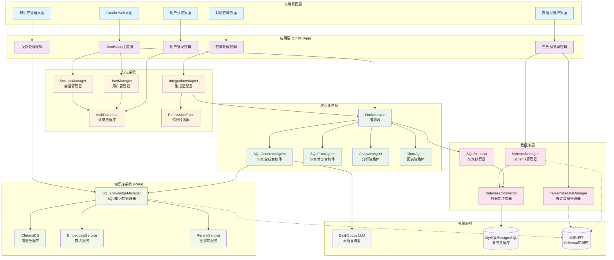

## ChatBI 应用架构说明

### 1. 前端界面层
- **Gradio Web界面**: 提供用户交互界面
- **用户认证界面**: 处理用户登录/注册
- **对话查询界面**: 自然语言查询入口
- **表信息维护界面**: 管理表和字段元数据
- **知识库管理界面**: 管理SQL知识库

### 2. 应用层 (ChatBIApp)
- **主应用**: 协调各个组件，管理应用状态
- **用户登录逻辑**: 处理用户认证流程
- **查询处理逻辑**: 处理用户查询请求
- **元数据管理逻辑**: 管理表和字段信息
- **反馈处理逻辑**: 处理用户反馈到知识库

### 3. 认证系统
- **UserManager**: 用户管理，处理注册/登录
- **SessionManager**: 会话管理，维护用户状态
- **AuthDatabase**: 认证数据存储
- **PermissionFilter**: 权限过滤，控制数据访问
- **IntegrationAdapter**: 集成适配器，包装业务组件

### 4. 核心业务层
- **Orchestrator**: 编排器，协调各个智能体
- **SQLGeneratorAgent**: SQL生成智能体，支持RAG
- **SQLFixerAgent**: SQL修复智能体
- **AnalyzerAgent**: 数据分析智能体
- **ChartAgent**: 图表生成智能体

### 5. 数据库层
- **SchemaManager**: Schema管理，支持权限过滤
- **DatabaseConnector**: 数据库连接，支持多种数据库
- **SQLExecutor**: SQL执行器，支持权限控制
- **TableMetadataManager**: 表元数据管理

### 6. 知识库系统 (RAG)
- **SQLKnowledgeManager**: SQL知识库管理
- **ChromaDB**: 向量数据库存储
- **EmbeddingService**: 文本嵌入服务
- **RerankService**: 结果重排序服务

### 7. 外部服务
- **DashScope LLM**: 阿里云大语言模型
- **MySQL/PostgreSQL**: 业务数据库
- **本地缓存**: Schema和知识库缓存

## 主要调用流程

### 用户查询流程
1. 用户在Gradio界面输入查询
2. ChatBIApp验证用户认证状态
3. IntegrationAdapter应用权限过滤
4. Orchestrator协调各个智能体
5. SQLGeneratorAgent生成SQL（使用RAG）
6. SQLExecutor执行SQL（权限控制）
7. 返回结果并可选生成图表/分析

### 表信息维护流程
1. 用户在维护界面选择表
2. SchemaManager获取表结构（权限过滤）
3. TableMetadataManager管理业务元数据
4. 更新数据库字段备注
5. 缓存更新的元数据信息

### 知识库反馈流程
1. 用户对查询结果点赞
2. SQLKnowledgeManager存储到向量数据库
3. 更新嵌入向量和索引
4. 用于后续RAG检索
